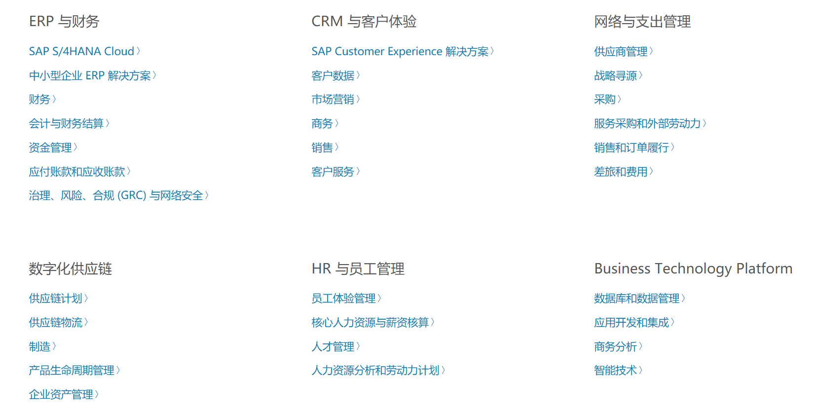

## SAP 群面准备
0. 为什么想加入

```
性格：把自己的个人性格和SAP公司文化联系在一起。
我说我在生活中是一个简单直率，喜欢高效率学习和生活的人，不喜欢把时间浪费在低效率的事情上。
如果我有幸能进入SAP，我就有更多的机会去学习或者创新技术，
并使用这些技术帮助公司以及客户更大地提高效率，为别人创造价值的同时，也实现了自己的价值。
```

1. SAP了解: 语言、技术

SAP 是全球领先的业务流程管理软件供应商
ABAP 
建立了ERP软件标准（ERP 是指企业资源规划。ERP 软件包括采购、生产、物料管理、销售、营销、财务和人力资源等所有核心业务领域的软件程序。SAP 是首批开发标准企业应用解决方案软件的企业之一。）




2. 职业发展：1-3，3-5年

希望在SAP能够找到自己最有兴趣的技术点，并成为这方面的高级工程师
努力做出创新，做一些有趣，有意义的事情！

3. 项目介绍（英文）

&nbsp;&nbsp;&nbsp;&nbsp;My internship project worked with another intern to develop a conversion tool. My responsibilities are software architecture design, module division, and writing software development documents.

&nbsp;&nbsp;&nbsp;&nbsp;The architecture design is based on MVC, and the modules are divided into blocks according to function points; responsible for the development of data processing modules.

&nbsp;&nbsp;&nbsp;&nbsp;Finally, the software development was successfully completed and put into use.


4. 灵活题: 依据论点，言之有理
5. 新技术：云计算（平台）、大数据的了解 

一切的资源、数据、计算中心都在一个庞大的服务器集群上。

客户不需要自己构建数据中心，通过购买云服务产品，在Paas(平台即服务),Saas(软件即服务),Issa(基础设施即服务)

公司也有产品 `SAP S/4HANA CLOUD`

所涉及的技术：`虚拟化 docker` `分布式数据存储 hadoop` `并行计算mapreduce` `云计算平台` `信息安全` 

### 2 技术面

#### 2.0 设计测试用例

```
功能测试，先正向测试，就是用户正常的使用，一般注意边界值，

然后反向测试, 用非值测试期望是提示错误。

然后性能测试，符合一般性能的要求，比如几秒内有反馈

同时压力测试多少用户可以不崩溃这种一般用工具
```

#### 2.1 常见算法题

- 最长回文字符串
- 最长不重复子串
- 最长公共前缀
- 最长递增子序列
- 连续子数组的最大和

#### 2.2 计网、os、排序、数据库

- 快排、归并 手写
- os的进程、线程
- TCP/IP与OSI，常见协议，作用
- TCP，UDP
- HTTP1.0、HTTP1.1、HTTP2.0、HTTPS
- 索引、引擎、优化、常见关键字

#### 2.3 OOP设计思想、设计原则、设计模式

- 设计思想
[查看](https://www.jianshu.com/p/df3fc7895056)
- [设计原则](https://www.cyc2018.xyz/%E5%85%B6%E5%AE%83/%E7%BC%96%E7%A0%81%E5%AE%9E%E8%B7%B5/%E9%9D%A2%E5%90%91%E5%AF%B9%E8%B1%A1%E6%80%9D%E6%83%B3.html#%E4%B8%89%E3%80%81%E8%AE%BE%E8%AE%A1%E5%8E%9F%E5%88%99)
    1. 单一职责： 每个类只实现一个功能，而不要融合太多功能在一个类里
    2. 开放封闭原则： 对扩展开放，对修改关闭（增加功能可以，修改不行）
    3. 里氏替换原则： 子类对象必须能够替换掉所有父类对象。
    4. 接口分离原则：多个专门的接口比使用单一的总接口要好
    5. 依赖倒置原则：高层模块不应该依赖于低层模块，二者都应该依赖于抽象；抽象不应该依赖于细节，细节应该依赖于抽象。

- [设计模式](https://www.cyc2018.xyz/%E5%85%B6%E5%AE%83/%E8%AE%BE%E8%AE%A1%E6%A8%A1%E5%BC%8F/%E8%AE%BE%E8%AE%A1%E6%A8%A1%E5%BC%8F%20-%20%E7%9B%AE%E5%BD%95.html#%E4%B8%80%E3%80%81%E5%89%8D%E8%A8%80)

- 抽象工厂、 单例 （手写单例的懒汉、饿汉）

简述作用，工厂类图

- 实习项目总结
```
设计架构，同时了解细节，自顶向下，依据功能点模块划分

把一段长代码，分成很多小函数，便于维护，连自己都不愿看，不愿改的代码，百分百有问题。
写程序时，先把流程搞清楚。把各个流程用的函数写清楚，函数可以留空，这样编程就变成了填空题。
做新功能时，把数据结构的设计，放在较重要的位置

复制代码是危险的。如果有两段相同的代码，几乎可以说一定是有问题的，因为每次改动，要维护两段代码

修改Bug时，一定要从最简单的基本的地方开始检查，不要检查到最底层没问题，发现是传入的某个参数是错的。先不要怀疑系统的部分。
有些Bug,调起来可能费时费力，甚至花个二三天，其实当时写的时候，只要稍微注意，就可以轻松避免。避免Bug的代价与找出并修改Bug的代价，实在是差太多了。
```

#### 2.4 Spring，SpringMVC，SpringBoot 常见问题

[个人博客](https://blog.csdn.net/qq_32603745/article/details/110569823)

[JavaGuide](https://snailclimb.gitee.io/javaguide/#/?id=springspringboot-%e5%bf%85%e7%9c%8b-1)

